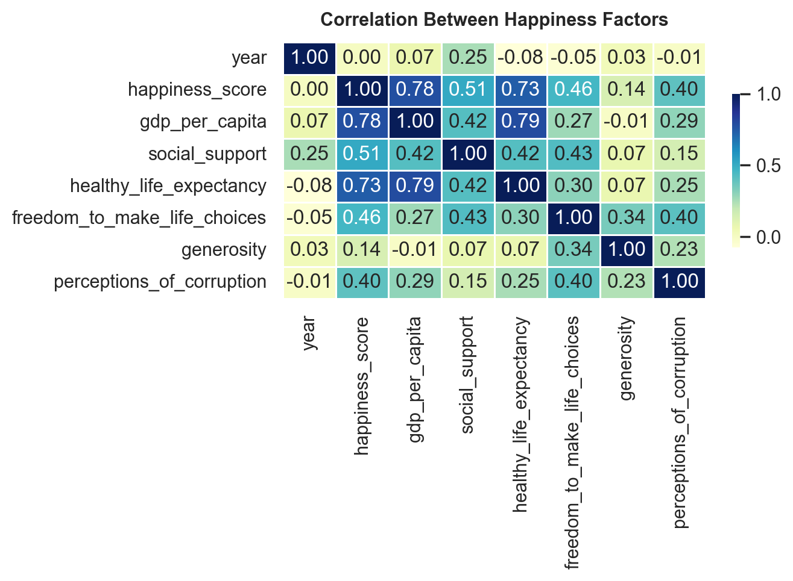
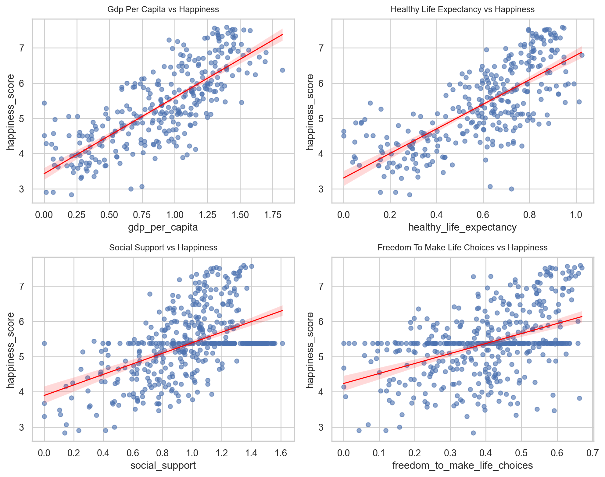
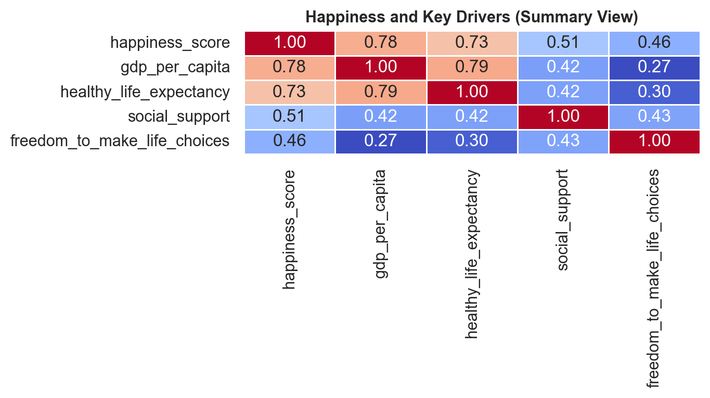

# 😊 World Happiness Insights Dashboard

This project explores global happiness trends across countries using data from the **World Happiness Report (2015–2019)**.  
It examines how key socio-economic and health-related factors influence national happiness and visualizes these relationships through data-driven insights.

The analysis uses **Python**, **Pandas**, **Matplotlib**, and **Seaborn** to create interactive, reproducible results for data visualization and modeling.

---

## 🌍 Dataset Overview

**Source:** [World Happiness Report – Kaggle Dataset]  
Contains data from 2015–2019, covering over 150 countries.

| Column Name                    | Description                                |
| ------------------------------ | ------------------------------------------ |
| `country`                      | Country name                               |
| `year`                         | Year of measurement                        |
| `happiness_score`              | Average self-reported happiness score      |
| `gdp_per_capita`               | Economic performance index                 |
| `social_support`               | Level of social connectedness              |
| `healthy_life_expectancy`      | Average expected lifespan                  |
| `freedom_to_make_life_choices` | Measure of personal freedom                |
| `generosity`                   | Contribution to charity and kindness       |
| `perceptions_of_corruption`    | Trust in institutions and corruption level |

---

## 🧱 Project Structure

```
world-happiness-insights/
│
├── data/                         # CSV datasets (2015–2019)
│   └── happiness_data.csv
│
├── notebooks/
│   └── happiness_analysis.ipynb   # Main analysis notebook
│
├── src/                          # Core Python scripts
│   ├── data_cleaning.py
│   ├── data_analysis.py
│   └── data_visualization.py
│
├── assets/                       # Generated plots and images
│   ├── happiness_correlation_heatmap.png
│   ├── happiness_factors_scatter.png
│   ├── happiness_regression_coeffs.png
│   └── happiness_summary_heatmap.png
│
├── requirements.txt              # Dependencies
└── README.md
```

---

## 🧹 Data Cleaning & Normalization

During preprocessing:

1. Combined yearly CSV files (2015–2019) into a single dataset
2. Standardized column names and removed duplicates
3. Filled missing values using forward-fill and median techniques
4. Normalized numeric columns for consistent scaling
5. Verified data integrity after transformation

✅ Final dataset: **470 rows × 9 key features**

---

## 📊 Exploratory Data Analysis (EDA)

We explored how various social and economic metrics influence happiness across countries.

### 🔸 Correlation Matrix



- Strong positive correlation between **GDP** and **Happiness (0.78)**
- Health expectancy and social support also strongly related
- Low correlation for generosity and corruption perception

---

### 🔸 Key Factor Scatter Plots



- **GDP per Capita** → strongest positive trend
- **Healthy Life Expectancy** → second strongest predictor
- **Social Support** → moderate effect
- **Freedom** → mild but significant positive effect

---

## 🤖 Linear Regression Modeling

We used **Multiple Linear Regression** to quantify how each factor contributes to happiness.

| Feature                      | Coefficient |
| ---------------------------- | ----------- |
| GDP per Capita               | +2.74       |
| Healthy Life Expectancy      | +1.89       |
| Social Support               | +1.22       |
| Freedom to Make Life Choices | +0.57       |

📈 **Model R² Score:** `0.78`  
This means ~78% of happiness variation is explained by these features.


---

## 💡 Summary Insights

1️⃣ **Economic prosperity** (GDP per capita) has the highest influence on happiness  
2️⃣ **Public health** and **life expectancy** strongly support overall well-being  
3️⃣ **Social connectedness** and **freedom** contribute positively to emotional satisfaction  
4️⃣ **Low corruption** aligns with higher happiness but has a weaker quantitative impact

---

### 🔸 Summary Heatmap



---

## 🧰 Tools & Technologies

| Category            | Tools                     |
| ------------------- | ------------------------- |
| **Language**        | Python 3.13               |
| **Data Analysis**   | Pandas, NumPy             |
| **Visualization**   | Matplotlib, Seaborn       |
| **Modeling**        | scikit-learn              |
| **Environment**     | Jupyter Notebook, VS Code |
| **Version Control** | Git & GitHub              |

---

## 🚀 How to Run the Project

### 1️⃣ Clone the Repository

```bash
git clone https://github.com/<your-username>/world-happiness-insights.git
cd world-happiness-insights
```

### 2️⃣ Create and Activate a Virtual Environment

```bash
python -m venv .venv
.venv\Scripts\activate        # On Windows
source .venv/bin/activate     # On macOS/Linux
```

### 3️⃣ Install Dependencies

```bash
pip install -r requirements.txt
```

### 4️⃣ Run the Jupyter Notebook

```bash
jupyter notebook notebooks/happiness_analysis.ipynb
```

---

## 📈 Results Summary

| Factor         | Impact Level | Relation |
| -------------- | ------------ | -------- |
| GDP per Capita | 🔹 Very High | Positive |
| Health         | 🔹 High      | Positive |
| Social Support | 🔸 Medium    | Positive |
| Freedom        | 🔸 Moderate  | Positive |
| Corruption     | ⚪ Low       | Negative |

---

## 🏁 Conclusion

This project demonstrates how key life-quality factors—**wealth, health, and freedom**—collectively shape global happiness levels.  
It provides a strong foundation for understanding societal well-being trends and building data-driven policy recommendations.

---

## 👨‍💻 Author

**Berke Arda Türk**  
Data Science & AI Enthusiast | Computer Science (B.ASc)  
[🌐 Portfolio Website](https://berke-turk.web.app/) • [💼 LinkedIn](https://www.linkedin.com/in/berke-arda-turk/) • [🐙 GitHub](https://github.com/Mood07)

